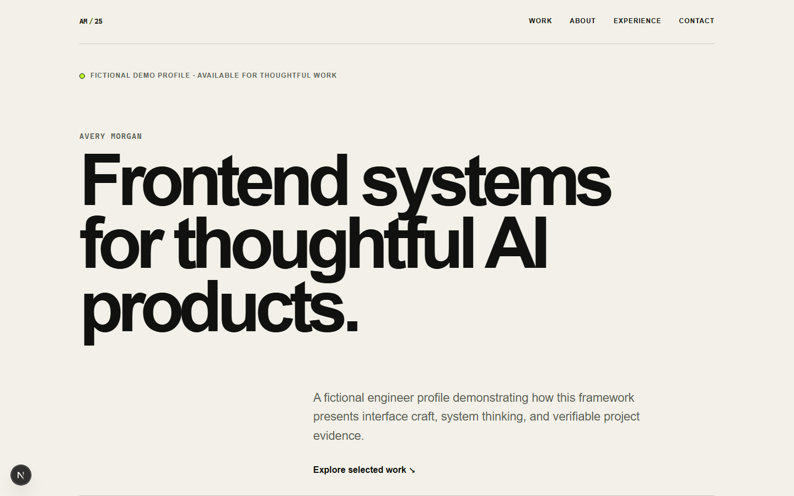
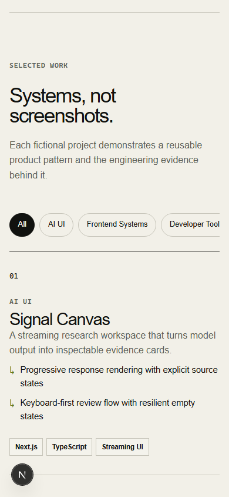

# Portfolio Framework

A privacy-safe, config-driven Next.js portfolio starter for presenting frontend systems and AI interface work with clear evidence.

## Interface preview



<p align="center">
  
</p>

## Thirty-second overview

- **Problem:** Portfolio sites often mix presentation code with private personal data and make technical work difficult to scan.
- **Solution:** A typed content model feeds reusable, accessible sections, while a repository scanner blocks common private-data and secret patterns before publication.
- **Role:** This repository demonstrates frontend architecture, interaction design, automated browser validation, and publication safety as one coherent system.
- **Result:** A fictional showcase that can be customized without copying private content or another site's history.

The sample identity, organizations, projects, claims, and contact address are fictional. They exist only to demonstrate the framework.

## Features

- Typed portfolio content with runtime validation
- Filterable project collection with predictable pure-function behavior
- Responsive editorial interface tested at desktop, tablet, and 320 px mobile widths
- Semantic navigation, visible focus states, native controls, and reduced-motion support
- Unit, component, and Playwright browser coverage
- Working-tree and complete Git-history safety scans
- Offline-compatible production build using system font stacks

## Architecture

Content flows in one direction: typed demo data is validated, composed by the page, and rendered through reusable sections. Project filtering stays isolated as a pure function. A separate safety scanner gates publication by checking both current files and reachable Git blobs.

See [Architecture](docs/architecture.md) for the data flow, component boundaries, and tradeoffs.

## Customization

1. Replace the fictional values in `content/demo-content.ts` while keeping the `PortfolioContent` contract.
2. Add or rearrange presentation sections in `app/page.tsx` and `components/portfolio/`.
3. Adjust design tokens and responsive rules in `app/globals.css`.
4. Keep public contact addresses intentional; the included validator accepts `example.com` addresses for the safe demo by design.
5. Run the full validation set before publishing any customized repository.

If you change the content rules, update `lib/portfolio-schema.ts` and its tests together.

## Local setup

Requirements: Node.js 22 or newer and npm.

```bash
npm ci
npm run dev
```

Open `http://localhost:3000`.

Create and run a production build:

```bash
npm run build
npm run start
```

No environment file or external service is required for the fictional demo.

## Validation

Run each supported gate from the repository root:

```bash
npm test
npm run lint
npm run build
npm run test:e2e
npm run check:public
npm run check:history
```

The browser suite starts and stops its own local development server. `check:public` scans tracked and nonignored files; `check:history` scans every reachable Git blob without printing a discovered secret value.

## Privacy model

- The repository contains only fictional identity and project data.
- Common credential assignments, non-example email addresses, absolute Windows user paths, environment files, private-key formats, and selected document formats are publication blockers.
- Current-tree and Git-history checks are separate because deleting a value from the latest file does not remove it from history.
- Screenshots are captured from this fictional interface and inspected before commit.

The scanner is a focused guardrail, not a guarantee. Review ownership, licenses, assets, links, and the complete staged diff before publishing a customized version.

## Limitations

- This repository is a framework demonstration, not a deployed personal site.
- The fictional projects do not link to live products or source repositories.
- The safety scanner detects selected high-risk patterns; it cannot identify every possible sensitive fact.
- Visual checks cover Chromium at the configured viewports, not every browser and device combination.

## License

Released under the [MIT License](LICENSE).
